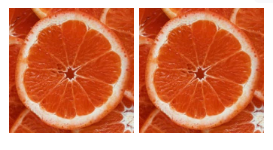

# <samp>HTML</samp>

<samp>超文本标记语言(HyperText Markup Language)，定义了网页的结构和内容；浏览器访问网站时，其实就是从服务器下载 HTML 代码，然后渲染出网页</samp>

<samp>1999年，HTML 4.01 发布</samp>

<samp>2014年，HTML 5 发布</samp>

<samp>`Ctrl` + `Shift` + `J`：Chrome 浏览器打开控制台</samp>

<samp>**标签**</samp>

<samp>网页的 HTML 代码由许许多多不同的标签(tag)构成</samp>

- <samp>标签分为单标签和双标签</samp>
- <samp>标签可以嵌套，必须正确闭合</samp>

- <samp>HTML 语言忽略缩进和换行</samp>

  > [!NOTE]
  >
  > <samp>`img` 标签会将换行视作一条线，不利于优化</samp>
  >
  > <samp>这是因为多个连续的空格，浏览器会将它们合并成一个，渲染时只渲染一个</samp>
  >
  > 

<samp>浏览器在渲染网页时，会把 HTML 源码解析成一颗标签树，**标签**就是树的**节点**(node)，这种节点也称为"**元素**"</samp>

<samp>**元素**分为**块级元素**(block)、**行内元素**(inline)</samp>

<samp>**属性**</samp>

<samp>属性(attribute)是标签的信息，空格与标签名和其他属性分隔</samp>

- <samp>属性值放在双引号内</samp>

- <samp>属性名大小写不敏感。如：`onclick` 和 `onClick` 是同一个属性</samp>

## <samp>网页的基本结构</samp>

```html
<!DOCTYPE html>
<html lang="zh-CN">
  <head>
    <meta charset="utf-8">
    <title></title>
  </head>
  <body>
  </body>
</html>
```

- <samp>`<!doctype>`：表示文档类型，告知浏览器浏览器按照 HTML5 的规则处理网页</samp>

- <samp>`<html>`：网页的顶层容器，也称为根元素(root element)，其他元素都是它的子元素。一个网页只能有一个 `<html>` 标签</samp>
  - <samp>`lang`：表示网页内容默认的语言</samp>
- <samp>`<head>`：放置网页的元信息，为网页渲染提供额外信息</samp>
  - <samp>`<meta>`：设置网页的元数据</samp>
  - <samp>`<link>`：连接外部样式表</samp>
  - <samp>`<title>`：设置网页标题；显示在浏览器的标题栏，内部只能放置无格式的纯文本</samp>
  - <samp>`<style>`：放置内嵌的样式表</samp>
  - <samp>`<script>`：引入脚本</samp>
  - <samp>`<noscript>`：浏览器不支持脚本时，所要显示的内容</samp>
  - <samp>`<base>`：设置网页内部相对 URL 的计算基准</samp>
- <samp>`<body>`：网页的主体内容</samp>
- <samp>注释：以 `<!--` 开头，以 `-->` 结尾</samp>

### `<meta>`

<samp>`<meta>`：设置或说明网页的元数据，必须放在 `<head>` 里面</samp>

```html
<head>
  <meta charset="utf-8">
  <meta name="viewport" content="width=device-width, initial-scale=1">
</head>
```

- <samp>`charset`：指定网页的编码方式；如果指定为 utf-8，实际采用其他编码，会导致网页乱码</samp>

- <samp>`name`：表示元数据的名字；`content`：表示元数据的值</samp>

  ```html
  <head>
    <!-- 网页在手机端可以自动缩放 -->
    <meta name="viewport" content="width=device-width, initial-scale=1">
    <meta name="description" content="Hello World">
    <meta name="keywords" content="抽烟,喝酒,烫头">
    <meta name="author" content="于谦">
    <meta name="application-name" content="Application Name">
    <meta name="generator" content="program">
    <meta name="subject" content="your document's subject">
    <meta name="referrer" content="no-referrer">
  </head>
  ```

- <samp>`http-equiv`：补充 HTTP 回应的头信息字段，如果服务器发回的 HTTP 回应缺少某个字段</samp>

  <samp>`content`：对应的字段内容</samp>

  ```html
  <head>
    <meta http-equiv="Content-Security-Policy" content="default-src 'self'">
    <meta http-equiv="Content-Type" content="Type=text/html; charset=utf-8">
    <meta http-equiv="refresh" content="30">
    <meta http-equiv="refresh" content="30;URL='http://website.com'">
  </head>
  ```

### `<base>`

<samp>`<base>`：指定网页内部的所有相对 URL 的计算基准，只能放在 `<head>` 里面，没有闭合标签</samp>

<samp>`<base>` 标签必须至少具有 `href` 属性或 `target` 属性之一</samp>

```html
<head>
  <base href="https://www.example.com/files/" target="_blank">
</head>
```

- <samp>`href`：给出计算的基准网址</samp>
- <samp>`target`：给出如何打开链接的说明</samp>

## <samp>URL</samp>

<samp>URL：统一资源定位符(Uniform Resource Locator)的缩写，"网址"，表示各种资源的互联网地址</samp>

- <samp>协议(scheme)：浏览器请求服务器资源的方法</samp>

  <samp>默认是 HTTP 协议；HTTPS 是 HTTP 的加密版本，出于安全考虑</samp>

- <samp>主机(host)：资源所在的网站名或服务器的名字，又称为域名</samp>

- <samp>端口(port)：同一个域名下面可能同时包含多个网站，通过端口区分；HTTP 协议的默认端口是 80</samp>

- <samp>路径(path)：是资源在网站的位置；路径只包含目录名，不包含文件名，默认指向目录里的 `index.html`</samp>

- <samp>查询参数(query parameter)：提供给服务器的额外信息</samp>

  <samp>参数位置在路径后面，使用 `?` 分隔</samp>

  <samp>多组参数之间使用 `&` 连接</samp>

- <samp>锚点(anchor)：网页内部的定位点，使用 `#` 加上锚点名称，放在网址的最后</samp>

  <samp>锚点名称通常是网页元素的 `id` 值</samp>

<samp>URL 的组成部分，只能使用以下这些字符</samp>

- <samp>26 个英语字母</samp>
- <samp>10 个阿拉伯数字</samp>

- <samp>连词号(`-`)</samp>

- <samp>句点(`.`)</samp>

- <samp>下划线(`_`)</samp>

<samp>18 个字符属于 URL 的保留字，转义字符：</samp>

- <samp>空格：%20</samp>

- <samp>`!`：%21</samp>
- <samp>`#`：%23</samp>
- <samp>`$`：%24</samp>
- <samp>`&`：%26</samp>
- <samp>`'`：%27</samp>
- <samp>`(`：%28</samp>
- <samp>`)`：%29</samp>
- <samp>`*`：%2A</samp>
- <samp>`+`：%2B</samp>
- <samp>`,`：%2C</samp>
- <samp>`/`：%2F</samp>
- <samp>`:`：%3A</samp>
- <samp>`;`：%3B</samp>
- <samp>`=`：%3D</samp>
- <samp>`?`：%3F</samp>
- <samp>`@`：%40</samp>
- <samp>`[`：%5B</samp>
- <samp>`]`：%5D</samp>

## <samp>属性</samp>

<samp>**属性**(attribute)：定制元素的行为，不同的属性会导致元素有不同的行为</samp>

- <samp>属性名与标签名一样，不区分大小写</samp>

- <samp>属性名与属性值之间，通过等号 `=` 连接</samp>

- <samp>如果属性是布尔属性，即属性值是一个布尔值，可以省略属性值，表示打开该属性</samp>

<samp>**全局属性**(global attributes)：所有元素都可以使用的属性</samp>

- <samp>`id`：表示元素的唯一标识符</samp>

  <samp>`id` 的属性值可以在前加上 `#`，表示作为锚点使用</samp>

  <samp><a href="#">回到顶部</a></samp>

- <samp>`class`：对网页元素进行分类；用 `.` 表示</samp>

- <samp>`title`：为元素添加附加说明；鼠标悬浮在元素上面时，`title` 属性值作为浮动提示</samp>

  <p title="喜欢的少年是你"><samp>你是年少的欢喜</samp></p>

- <samp>`tabindex`： Tab 的顺序(index)</samp>

  - <samp>负整数：获取焦点(如：JavaScript 的 `focus()`)，不参与 Tab 键对网页元素遍历，通常为 `-1`</samp>

  - <samp>`0`：参与 Tab 键的遍历，通常是按照在网页里出现的位置(建议设置为 `0`，按照自然顺序排列)</samp>

    ```html
    <p tabindex="0">获取焦点</p>
    ```

  - <samp>正整数：按照从小到大的顺序，参与 Tab 键的遍历，如果多个元素 `tabindex` 属性相同，则按照源码顺序遍历</samp>

- <samp>`accesskey`：指定网页元素获得焦点的快捷键</samp>

  > - <samp>必须配合功能键按下生效</samp>
  >
  >   <samp>Windows 与 Linux：`Alt` + `字符`</samp>
  >
  >   <samp>Mac：`Ctrl` + `Alt` + `字符`</samp>
  >
  > - <samp>如果与操作系统或浏览器级别的快捷键有冲突，不会生效</samp>

  ```html
  <button accesskey="s">提交</button>
  ```

- <samp>`style`：指定元素的 CSS 样式</samp>

- <samp>`hidden`：是一个布尔属性，表示当前网页元素不再与网页相关，浏览器将不再渲染该元素</samp>

  ```html
  <p hidden>这段将不会显示在页面上。</p>
  ```

  > <samp>CSS 可见性要高于 `hidden` 属性，当 CSS 设置为可见时，`hidden` 属性将无效</samp>

- <samp>`lang`：指定网页元素使用的语言</samp>

  ```html
  <p lang="en">hello</p>
  <p lang="zh">你好</p>
  ```

  <samp>`lang` 必须符合 BCP47 标准</samp>

  - <samp>`zh`：中文</samp>
  - <samp>`zh-Hans`：简体中文</samp>
  - <samp>`zh-Hant`：繁体中文</samp>
  - <samp>`en`：英语</samp>
  - <samp>`en-US`：美国英语</samp>
  - <samp>`en-GB`：英国英语</samp>
  - <samp>`es`：西班牙语</samp>
  - <samp>`fr`：法语</samp>

- <samp>`dir`：文字的阅读方向</samp>
  - <samp>`ltr`：从左向右</samp>
  - <samp>`rtl`：从右向左</samp>
  - <samp>`auto`：由浏览器根据内容自行决定</samp>

- <samp>`translate`：用于文本元素，指示翻译软件是否需要翻译该文本</samp>

  <samp>`no` 表示不需要；`yes` 表示需要</samp>

- <samp>`contenteditable`：允许用户修改内容</samp>

  <samp>`true` 或空字符串，表示内容可编辑；`false` 表示不可编辑</samp>

  ```html
  <p contenteditable="true">
    <samp>本句内容可修改</samp>
  </p>
  ```

  <p contenteditable="true">
    <samp>本句内容可修改</samp>
  </p>

- <samp>`spellcheck`：是否打开拼写检查；需要配合可编辑元素使用(如：`conteneditable`)才生效</samp>

  ```html
  <p contenteditable="true" spellcheck="true">
    separate 与 seperate
  </p>
  ```

- <samp>`data-`：自定义数据，如果没有其他属性或元素合适放置数据时，可以放置在 `data-` 属性中</samp>

  <samp>通常配合 CSS 一起使用</samp>

  ```html
  <div data-role="mobile">
    Mobile only
  </div>
  
  <style>
    div[data-role="mobile"] {
      display: none;
    }
  </style>
  ```

- <samp>事件处理属性</samp>

  <samp>事件处理属性 (event handler)：响应用户的动作</samp>

  > <samp>`onabort`, `onautocomplete`, `onautocompleteerror`, `onblur`, `oncancel`, `oncanplay`, `oncanplaythrough`, `onchange`, `onclick`, `onclose`, `oncontextmenu`, `oncuechange`, `ondblclick`, `ondrag`, `ondragend`, `ondragenter`, `ondragexit`, `ondragleave`, `ondragover`, `ondragstart`, `ondrop`, `ondurationchange`, `onemptied`, `onended`, `onerror`, `onfocus`, `oninput`, `oninvalid`, `onkeydown`, `onkeypress`, `onkeyup`, `onload`, `onloadeddata`, `onloadedmetadata`, `onloadstart`, `onmousedown`, `onmouseenter`, `onmouseleave`, `onmousemove`, `onmouseout`, `onmouseover`, `onmouseup`, `onmousewheel`, `onpause`, `onplay`, `onplaying`, `onprogress`, `onratechange`, `onreset`, `onresize`, `onscroll`, `onseeked`, `onseeking`, `onselect`, `onshow`, `onsort`, `onstalled`, `onsubmit`, `onsuspend`, `ontimeupdate`, `ontoggle`, `onvolumechange`, `onwaiting`</samp>

## <samp>字符编码</samp>

<samp>服务器向浏览器发送 HTML 网页文件时，会通过 HTTP 头信息，声明网页的编码方式</samp>

<samp>`Content-Type`：服务器发送的数据类型是 `text/html` (HTML 网页)，网页的文字编码是 `UTF-8`</samp>

```xml
Content-Type: text/html; charset=UTF-8
```

<samp>UTF-8 是 Unicode 字符集的一种表达方式，设计目的是包含世界上所有字符</samp>

<samp>每个字符的 Unicode 称为码点(code point)</samp>

- <samp>不是每个 Unicode 字符都可以被打印，比如换行符的码点是十进制 10 (十六进制的 A)，没有对应的字面形式</samp>

- <samp>网页不允许混合使用多种编码，比如：使用了 UTF-8 就不能再插入其他编码字符</samp>

<samp>字符的码点的用 `N` 表示</samp>

- <samp>十进制：`&#N;` </samp>

- <samp>十六进制：`&#xN;`</samp>

```html
<p>hello</p>

<p>&#104;&#101;&#108;&#108;&#111;</p>

<p>&#x68;&#x65;&#x6c;&#x6c;&#x6f;</p>
```

<samp>字符实体(entity)：也叫转义字符</samp>

- <samp>`<`：`&lt;`</samp>
- <samp>`>`：`&gt;`</samp>
- <samp>`"`：`&quot;`</samp>
- <samp>`'`：`&apos;`</samp>
- <samp>`&`：`&amp;`</samp>
- <samp>`©`：`&copy;`</samp>
- <samp>`#`：`&num;`</samp>
- <samp>`§`：`&sect;`</samp>
- <samp>`¥`：`&yen;`</samp>
- <samp>`$`：`&dollar;`</samp>
- <samp>`£`：`&pound;`</samp>
- <samp>`¢`：`&cent;`</samp>
- <samp>`%`：`&percnt;`</samp>
- <samp>`*`：`&ast;`</samp>
- <samp>`@`：`&commat;`</samp>
- <samp>`^`：`&Hat;`</samp>
- <samp>`±`：`&plusmn;`</samp>
- <samp>空格：`&nbsp;`</samp>

## <samp>语义(semantic)</samp>

```html
<header>页眉</header>
<main>
  <article>
    <h1>文章标题</h1>
    <p>文章内容</p>
  </article>
</main>
<footer>页尾</footer>
```

- <samp>`header`：既可以表示网页头部，也可表示文章或区块头部</samp>
  - <samp>当作为网页头部时，称为"页眉"，放置导航和搜索栏 </samp>
  - <samp>当作为文章头部时，放置文章标题、作者信息</samp>
  - <samp>`header` 只能包含一个，不能嵌套 `footer`</samp>

- <samp>`footer`：页尾，包含版权信息和其他相关信息</samp>
  - <samp>也可放在文章末尾</samp>
  - <samp>`footer` 不能嵌套 `header` 和 `footer`</samp>

- <samp>`main`：表示文章主题内容，一个页面只有一个 `main`</samp>
  - <samp>`main` 是顶层的标签，不能放置在 `header`、`footer`、`article`、`aside`、`nav` 等</samp>
  - <samp>功能性相关(如：搜索栏)不适合放入 `main`</samp>
- <samp>`article`：表示一段完整内容；如：一篇文章或一个帖子；包含标题等</samp>
  - <samp>一个网页可以包含一个或多个 `article`</samp>

- <samp>`aside`：放置与网页或文章主要内容间接相关部分；侧边栏、补充信息、评论等</samp>

- <samp>`section`：表示一个包含主题的独立部分，通常表示一个章节</samp>

- <samp>`nav`：放置页面或文档的导航信息</samp>
  - <samp>`nav` 往往放置在 `header`，不适合在 `footer`</samp>
  - <samp>`nav` 通常是列表</samp>

- <samp>`hgroup`：主标题包含多级标题</samp>
  - <samp>`hgroup` 只能包含 `h1`~`h6`，不能包含其他标签</samp>

## <samp>文本标签</samp>

- <samp>`div`：块级元素容器的通用标签；表示一个区块(division)</samp>

- <samp>`p`：块级元素，表示一个段落(paragraph)；可以是文本、图片、表单</samp>

- <samp>`span`：通用的行内元素标签</samp>

- <samp>`br`：换行</samp>

  > <samp>块级元素的间隔，不要使用 `br`，而是通过 CSS 样式调节</samp>

- <samp>`wbr`：表示可选的断行；通常是在外语一些单词很长的语言或 URL 的断行</samp>

  > <samp>如果一行的宽度足够，就不断行</samp>
  >
  > <samp>如果一行的宽度不够，就断行</samp>

- <samp>`hr`：表示文章中分隔不同的主题，会被浏览器渲染成一个水平线</samp>

  > [!TIP]
  >
  > <samp>这是一个历史遗留的标签，建议尽量避免使用，分割主题建议使用 `section`</samp>

- <samp>`pre`：块级元素，保留原来的格式(preformatted)，保留原始的换行和空格</samp>

- <samp>`strong`：行内元素。表示内容具有很强的重要性，以粗体显示</samp>

- <samp>`b`：表示内容需要引起注意的，以粗体显示(Boldface)</samp>

  > <samp>它没有语义，违反了语义和样式分离的原则，建议优先使用 `strong`</samp>

- <samp>`em`：行内元素；表示强调(emphasize)；以斜体表示</samp>

- <samp>`i`：(Italic) 表示与其他地方有所区别，以斜体表示</samp>

  > <samp>语义不强，建议优先使用 `em`</samp>

- <samp>`sub`：下标</samp>

- <samp>`sup`：上标</samp>

- <samp>`var`：表示代码或数学公式的变量</samp>

- <samp>`u`：表示对内容提供某种注释；表示拼写错误。下划线表示</samp>

  > <samp>`u` 会产生下划线，容易被误认为超链接，因此建议 CSS 清除样式</samp>

- <samp>`s`：删除线</samp>

- <samp>`blockquote`：块级标签；表示引用他人的话</samp>

  <samp>`cite` 属性：值为网址，表示引言的来源，不会显示在网页</samp>

  ```html
  <blockquote cite="https://quote.example.com">
    <p>天才就是 1% 的天赋和99%的汗水。</p>
  </blockquote>
  ```

- <samp>`cite`：文章资料来源</samp>

  ```html
  <p>更多资料请看<cite>维基百科</cite>。</p>
  ```

- <samp>`q`：行内标签；引言</samp>

  > <samp>浏览器默认会斜体显示，并且会自动添加半角的双引号</samp>

  ```html
  <p>
    莎士比亚的《哈姆雷特》有一句著名的台词：
    <q cite="https://quote.example.com">活着还是死亡，这是一个问题。</q>
  </p>
  ```

- <samp>`code`：行内元素；表示计算机代码</samp>

  > <samp>如果需要显示多行代码，需要放置在 `pre` 内部</samp>

- <samp>`kbd`：行内元素；表示输入的内容，包含语音输入；以等宽字体显示，可以嵌套</samp>
- <samp>`samp`：行内元素；表示计算机程序输出内容的一个例子，以等宽字体显示</samp>

- <samp>`mark`：行内元素；表示突出显示的内容；以亮黄色背景显示</samp>

- <samp>`small`：行内元素；常用于文章附带的版权信息或法律信息；以小一号字体显示</samp>

- <samp>`time`：行内标签；为跟时间相关的内容提供机器可读格式</samp>

  <samp>`datetime` 属性：指定机器可读的日期的格式</samp>

  ```html
  <p>音乐会在<time datetime="20:00">晚上八点</time>开始</p>
  ```

  - <samp>年份：`2011`</samp>
  - <samp>年月：`2011-11`</samp>
  - <samp>年月日：`2011-11-18`</samp>
  - <samp>日期：`11-18`</samp>
  - <samp>第几周：`2011-W47`</samp>
  - <samp>有效时间：`14:54`、`14:54:39`、`14:54:39.929`</samp>
  - <samp>日期和时间：`2011-11-18T14:54:39.929`</samp>

- <samp>`data`：提供机器可读内容</samp>

  <samp>`value` 属性：表示内容</samp>

  ```html
  <p>本次马拉松比赛第一名是<data value="39">张三</data></p>
  ```

- <samp>`address`：块级元素；表示某人或某个组织的联系方式</samp>

  - <samp>内容不能包含非联系信息，如：地址、日期</samp>
  - <samp>不能嵌套，内部不能包含标题等标签</samp>
  - <samp>`address` 通常放在 `footer` 标签内</samp>

- <samp>`abbr`：行内元素；表示标签内容的缩写</samp>

  <samp>`title` 属性：鼠标悬停时给出完整提示；某些浏览器提供圆点下划线显示</samp>

- <samp>`ins`：行内元素；表示给原始文档添加(insert)内容</samp>

- <samp>`del`：表示删除(delete)的内容</samp>

  <samp>添加和删除都具有 `cite` 和 `datetime` 属性</samp>

  <samp>`cite`：值为 URL，表示该网址可解释本次删改 </samp>

  <samp>`datetime`：表示删改的时间</samp>

- <samp>`dfn`：行内元素；表示标签内容是一个术语(definition)</samp>
  - <samp>和 `title` 结合使用，表示提示内容</samp>
  - <samp>`dfn` 本身也是缩写，可以和 `abbr` 结合使用</samp>

- <samp>`ruby`：表示文字的语音注释；主要用于东亚，如：汉语拼音、日语片假名，默认将语音注释，以小字体显示在文字上方</samp>

  - <samp>`rp`：为不支持语音注释的浏览器，提供一个兼容的方案</samp>

    ```html
    <ruby>
    汉<rp>(</rp><rt>han</rt><rp>)</rp>
    字<rp>(</rp><rt>zi</rt><rp>)</rp>
    </ruby>
    ```

    <samp><ruby>
    汉<rp>(</rp><rt>han</rt><rp>)</rp>
    字<rp>(</rp><rt>zi</rt><rp>)</rp>
    </ruby></samp>

  - <samp>`rt`：放置语音注释</samp>

  - <samp>`rb`：划分文字单位，与语音注释一一对应(Chrome 不支持)</samp>

    ```html
    <ruby>
      <rb>汉</rb><rb>字</rb>
      <rp>(</rp>
      <rt>han</rt>
      <rt>zi</rt>
      <rp>)</rp>
    </ruby>
    ```

  - <samp>`rbc`：表示一组文字，通常包含多个 `rb` 元素</samp>

  - <samp>`rtc`：表示一组语音注释，跟 `rbc` 对应</samp>

    > <samp>Chrome 不支持</samp>

    ```html
    <ruby style="ruby-position: under;">
      <rbc>
        <rb>汉</rb><rp>(</rp><rt>han</rt><rp>)</rp>
        <rb>字</rb><rp>(</rp><rt>zi</rt><rp>)</rp>
      </rbc>
      <rtc style="ruby-position: over;">
        <rp>(</rp><rt>Chinese</rt><rp>)</rp>
      </rtc>
    </ruby>
    ```

- <samp>`bdo`：行内元素；表示文字方向和网页主题内容方向不一致</samp>

  ```html
  <p>床前明月光，<bdo dir="rtl">霜上地是疑</bdo>。</p>
  ```

- <samp>`bdi`：表示不确定文字方向，让浏览器自己决定</samp>

  ```html
  <p><bdi>床前明月光，疑是地上霜。</bdi></p>
  ```

## <samp>列表</samp>

- <samp>`ol`：有序列表容器(ordered list)</samp>

  > <samp>可以嵌套 `ol` 或 `ul` 标签，形成多级列表</samp>

  - <samp>`reversed`：倒序的数字列表</samp>

  - <samp>`start`：值是一个整数，表示数字列表的起始编号</samp>

  - <samp>`type`：指定数字编号的样式</samp>

    - <samp>`1`：整数(默认值)</samp>
    - <samp>`a`：小写字母</samp>
    - <samp>`A`：大写字母</samp>
    - <samp>`i`：小写罗马数字</samp>
    - <samp>`I`：大写罗马数字</samp>

    > [!NOTE]
    >
    > <samp>`type` 使用了字母，`start` 的属性值依然使用数字，例如：`start="3"` 表示从 `c` 开始</samp>

- <samp>`ul`：一个无序列表容器(unordered list)</samp>

  <samp>`ul` 标签内部可以嵌套 `ul` 或 `ol`，形成多级列表</samp>

- <samp>`li`：表示列表项，用在 `ol` 或 `ul` 容器之中</samp>

  <samp>`value` 属性：定义当前列表项的编号，后面列表项会从这个值开始编号</samp>

- <samp>`dl`：块级元素，表示一组术语的列表(description list)</samp>
  - <samp>`dt` (description term)：术语</samp>
  - <samp>`dd` (description detail)：解释</samp>

## <samp>img</samp>

<samp>`img`：行内元素。用于插入图片</samp>

> - <samp>它会将行高撑高，与文字在同一水平线位置</samp>
>
> - <samp>与 `a` 标签一起使用，将图片变成一个超链接</samp>

- <samp>`alt`：图片的文字说明，在无法显示时(下载失败、关闭图片加载等)显示文本</samp>

- <samp>`width`：宽度；单位：像素或百分比</samp>

- <samp>`height`：高度；单位：像素或百分比</samp>

  > <samp>当宽度和高度只设置一个时，会自适应调整比例</samp>

- <samp>`referrerpolicy`：图片加载的 HTTP 请求，默认会带有 `Referer` 头信息。对该行为进行设置</samp>

- <samp>`crossorigin`：图片和网页属于不同的网站，网页加载图片就会导致跨域请求，对方服务器可能要求跨域认证。用来告诉浏览器，是否采用跨域的形式下载图片，默认是不采用</samp>

  - <samp>`anonymous`：跨域请求不带有用户凭证(通常是 Cookie)</samp>

    ```html
    <!-- anonymous可省略 -->
    
    ```

  - <samp>`use-credentials`：跨域请求带有用户凭证</samp>

- <samp>`loading`：只要解析到 html，就开始加载图片；对于很长的网页，这样做很浪费带宽，因为用户不一定会往下滚动，一直看到网页结束。用户很可能是点开网页，看了一会就关掉了，那些不在视口的图片加载的流量，就都浪费了</samp>

  - <samp>`auto`：浏览器默认行为，等同于不使用 `loading` 属性</samp>
  - <samp>`lazy`：启用懒加载</samp>
  - <samp>`eager`：立即加载资源，无论它在页面上的哪个位置</samp>

### <samp>figure</samp>

<samp>`figure`：图像区块；将图像和相关信息放在一起</samp>

> <samp>`figure` 可以封装引言、代码、诗歌等。将主体内容与附加信息，封装在一起的语义容器</samp>

<samp>`figcaption`：`figure` 的可选子元素；图像文本描述；通常用于放置标题</samp>

```html
<figure>
  
  <figcaption>示例图片</figcaption>
</figure>
```

### <samp>响应式</samp>

<samp>**响应式设计**(responsive web design)：根据不同尺寸的设备，产生良好的显示效果；响应式设计的图像，就是**响应式图像**(responsive image)</samp>

<samp>处理起来会产生三个问题</samp>

- <samp>**体积**：桌面端显示的是大尺寸图像，文件较大；手机端屏幕小，需要显示小尺寸，节省带宽和流量</samp>
- <samp>**像素密度**：桌面显示器是单倍像素密度，手机端是多倍像素密度，即显示时多个像素合并为一个像素，称为 Retina 屏幕；桌面端的图片没有足够高的像素精度，所以移到手机端会导致图像的锐利度有所下降</samp>
- <samp>**视觉风格**：在桌面上，面积较大可以容纳更多细节；手机屏幕小，只需突出重点即可</samp>

<samp>响应式图像属性</samp>

- <samp>`srcset`：指定多张图像，适应不同像素密度的屏幕，值采用逗号分隔</samp>

  <samp>如果 `srcset` 不满足条件，就加载 `src` 默认图像</samp>

  ```html
  <!-- 1x表示单倍像素密度 -->
  
  ```

- <samp>`sizes`：像素密度的适配，只适合显示区域一样大小的图像。如果希望不同尺寸的屏幕，显示不同大小的图像</samp>

  > <samp>`sizes` 必须和 `srcset` 搭配使用，否则无效</samp>

  ```html
  <!-- 原始宽度分别为 160像素, 320像素, 640像素, 1280像素 -->
  
  ```

  <samp>`sizes` 可以列出不同设备的图像显示宽度；将每个部分都放在括号里面的媒体查询表达式</samp>

  ```html
  
  ```

  <samp>根据设备宽度，在 `srcset` 中选出最接近的图像进行加载</samp>

### <samp>picture</samp>

<samp>`picture`：内部使用 `source` 和 `img`。根据不同的情况加载图像</samp>

> <samp>`srcset` 和 `sizes` 分别解决了像素密度和屏幕大小的适配</samp>
>
> <samp>`picture` 同时适配不同像素密度和不同大小的屏幕</samp>

```html
<picture>
  <source media="(max-width: 500px)" srcset="cat-vertical.jpg">
  <source media="(min-width: 501px)" srcset="cat-horizontal.jpg">
  
</picture>
```

> <samp>设置了 `media` 属性，就没有必要设置 `sizes` 属性了</samp>

<samp>同时考虑像素密度和屏幕尺寸的适配</samp>

```html
<picture>
  <source srcset="homepage-person@desktop.png,
                  homepage-person@desktop-2x.png 2x"
          media="(min-width: 990px)">
  <source srcset="homepage-person@tablet.png,
                  homepage-person@tablet-2x.png 2x"
          media="(min-width: 750px)">
  
</picture>
```

###  <samp>图像格式</samp>

<samp>`picture` 可以用于选择不同格式的图像</samp>

```html
<picture>
  <source type="image/svg+xml" srcset="logo.xml">
  <source type="image/webp" srcset="logo.webp"> 
  
</picture>
```

<samp>浏览器将按照 `source` 出现的顺序，依次检查格式是否支持，按照先后顺序加载；如果支持将不再检查后续图像格式</samp>

## <samp>CSS Reset</samp>

- <samp>方案一：[CSS Tools: Reset CSS](https://meyerweb.com/eric/tools/css/reset/)</samp>

- <samp>方案二：[雅虎的 CSS Reset](https://yuilibrary.com/yui/docs/cssreset/)</samp>

